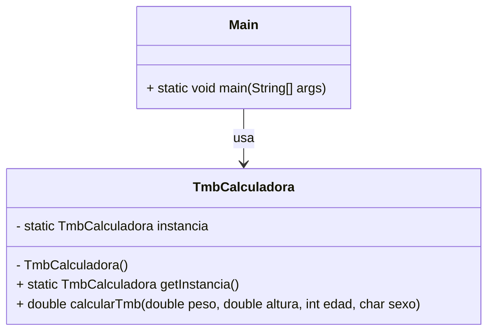

# Proyecto Java - Tasa Metabólica Basal con Patrón Singleton

Este proyecto en Java, desarrollado en **NetBeans**, implementa el **Patrón de Diseño Singleton** para calcular la **Tasa Metabólica Basal (TMB)**.  

El Singleton garantiza que exista **una sola instancia** de la clase encargada de realizar los cálculos de la TMB.

---

## 🚀 Funcionalidades

- Solicita al usuario:
  - Peso (kg)  
  - Altura (cm)  
  - Edad (años)  
  - Sexo (M/F)  

- Calcula la **TMB** usando la fórmula de **Mifflin-St Jeor**:

  - Hombres:  
    `TMB = (10 × peso) + (6.25 × altura) - (5 × edad) + 5`

  - Mujeres:  
    `TMB = (10 × peso) + (6.25 × altura) - (5 × edad) - 161`

- Muestra el resultado de la TMB en consola.  

---

## 🛠️ Tecnologías

- **Java SE**  
- **NetBeans IDE**  
- Patrón de diseño **Singleton**  
- Entrada/salida por **consola**

---

## 📂 Estructura del proyecto

```
ProyectoTmbSingleton/
├── src/
│   ├── tmb/
│   │   ├── TmbCalculadora.java
│   │   └── Main.java
├── README.md
```

---

## 📊 Diagrama UML



---

## ▶️ Ejemplo de ejecución

```
Ingrese su peso (kg): 70
Ingrese su altura (cm): 175
Ingrese su edad (años): 25
Ingrese su sexo (M/F): M

Su TMB es: 1668.75 kcal/día
```

---

## 📌 Autor
-Saimari Alpizar Vives. 
-Proyecto académico para la asignatura Patrones de Diseño- Universidad de Matanzas Camilo Cienfuegos.
